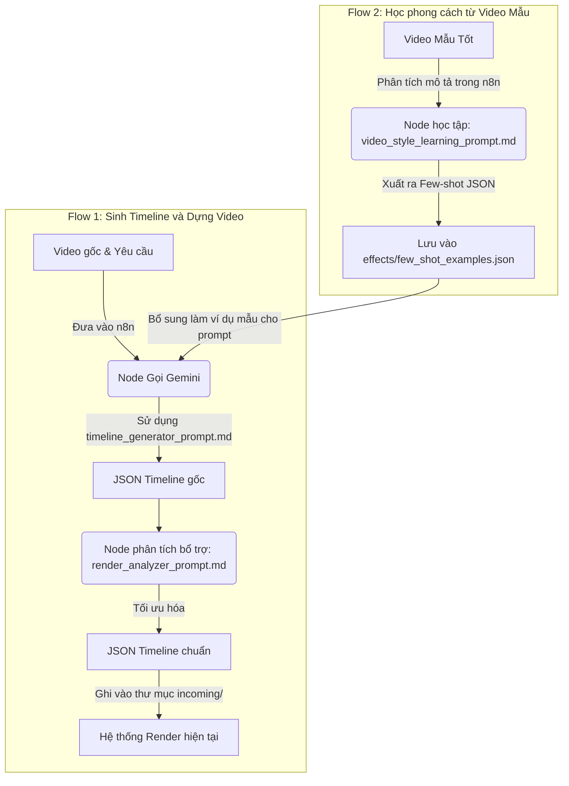

# KẾ HOẠCH PHÁT TRIỂN: HỆ THỐNG PROMPT AI & FLOW N8N (LEARNING & GENERATOR)

Tài liệu này lưu trữ lại kế hoạch thiết kế cho hệ thống AI Video Scene Generator tích hợp cơ chế học phong cách dựng video thông qua n8n.

---

## 1. Thiết kế Luồng Tích hợp n8n

---

## 2. Cấu trúc thư mục Prompt
Toàn bộ các prompt được lưu trữ tập trung tại thư mục `renderer/prompts/` để bạn có thể tải động hoặc copy/paste sang n8n:
- **[timeline_generator_prompt.md](file:///Users/khan/Library/CloudStorage/Nextcloud-ltckha@nc․giayhainancy․vn/Share_Folder/Long2Short/renderer/prompts/timeline_generator_prompt.md):** Nhận video mô tả và sinh ra JSON timeline chuẩn.
- **[video_style_learning_prompt.md](file:///Users/khan/Library/CloudStorage/Nextcloud-ltckha@nc․giayhainancy․vn/Share_Folder/Long2Short/renderer/prompts/video_style_learning_prompt.md):** Nhận đầu vào video mẫu thành công để học cách sinh hiệu ứng chữ, hiệu ứng chuyển cảnh và nhịp điệu.
- **[render_analyzer_prompt.md](file:///Users/khan/Library/CloudStorage/Nextcloud-ltckha@nc․giayhainancy․vn/Share_Folder/Long2Short/renderer/prompts/render_analyzer_prompt.md):** Bổ trợ cho render, kiểm tra tính hợp lệ của timeline trước khi đưa vào hàng đợi `incoming/`.

---

## 3. Nguyên lý học máy liên tục (Learning Mechanism)
- Khi AI học được các hiệu ứng mới từ video mẫu thông qua Flow 2 trên n8n, các cấu trúc JSON mẫu (Few-shot) sẽ được ghi lại.
- Các hiệu ứng chữ hay hiệu ứng chuyển cảnh mới (dù chưa được định nghĩa cứng trong code) khi được đưa vào timeline render sẽ tự động kích hoạt bộ lọc heuristics/similarity trong `effectLearning.js` để tìm ra cấu trúc render tương thích nhất (hoặc sử dụng làm gợi ý để lập trình viên mở rộng `effects.js` sau này).
